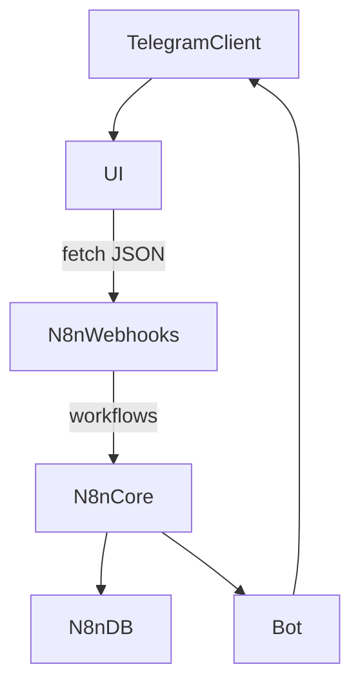
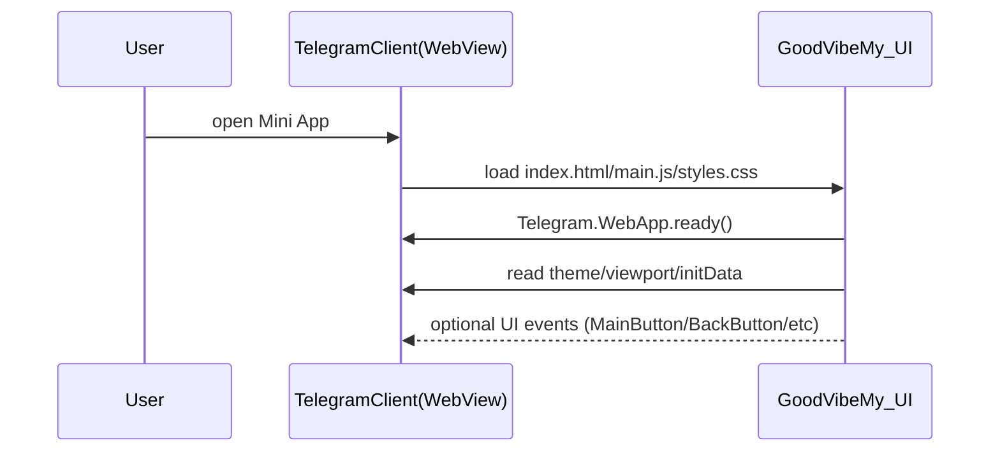
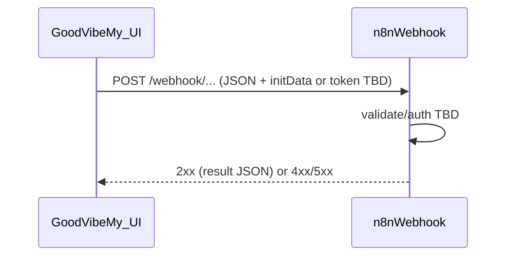

# GoodVibe.My — описание проекта (draft)

## TL;DR

**GoodVibe.My** — UI-часть децентрализованного приложения в формате **Telegram Mini App**. Это **статичный сайт** без фреймворков: только `index.html`, `main.js`, `styles.css`.

UI делает **прямые запросы** к **n8n webhooks**. **Self-hosted n8n (Node) + его встроенная БД/хранилище** выступают как “бэкенд” на текущем этапе. **Telegram Bot** — связующее звено (уведомления/триггеры/интеграции).

Разделы/экраны/компоненты UI будут уточнены позже.

## Цели

- Быстрый, предсказуемый UI в WebView Telegram без SPA-фреймворков.
- Минимальная поверхность атаки/сложности: один набор статических файлов, без сборки/рантаймов.
- Прозрачный путь интеграции с n8n (self-hosted) и Telegram Bot.

## Не цели (пока)

- Не “универсальный сайт” для обычных браузеров — первичная среда исполнения: Telegram WebView.
- Не “толстый клиент” с локальной БД/сложным state-management.
- Не фреймворк-подход (React/Vue/Svelte и т.п.).

## Ограничения и принципы реализации (no-framework)

- **Файлы**: `index.html`, `main.js`, `styles.css` (+ при необходимости статические assets).
- **Без сборки по умолчанию**: максимум — ручные модули/ESM при поддержке, либо один `main.js`.
- **Изоляция зависимостей**: если что-то подключаем — только как статичный файл/ESM, без “пакетного” фреймворка.
- **Telegram Mini App API**: используем нативно `window.Telegram.WebApp` (без отдельного SDK пакета).

## Среда выполнения

- Telegram Mini App запускается внутри Telegram WebView.
- Основной API для контекста/UX: `Telegram.WebApp` (инициализация, тема, кнопки, события, initData и т.д.).

## Интеграции (на текущий момент)

- **n8n**: UI вызывает webhooks **напрямую** из браузера (TMA WebView).
- **Self-hosted n8n (Node) + встроенная БД n8n**: “backend” в текущем понимании — это сам n8n как оркестратор/точка входа + его хранение (конкретика по данным TBD).
- **Telegram Bot**: мост для взаимодействия с Telegram (уведомления, команды, диплинки/приглашения, возможно выдача токенов — TBD).

## Публичные интерфейсы (черновик)

- **UI → n8n**: `fetch()` запросы к webhook endpoints (JSON).
- **Bot ↔ n8n**: бот дергает n8n/его хранилище (детали TBD).

## Архитектура (черновик)

### Компоненты

- **Telegram Client**: контейнер, где запускается Mini App (WebView).
- **GoodVibe.My UI (static)**: `index.html` + `main.js` + `styles.css`.
- **n8n (self-hosted, Node)**: оркестрация/логика через workflows + webhooks (публичные точки входа) + встроенная БД/хранилище.
- **Telegram Bot**: исходящие/входящие взаимодействия с Telegram API, уведомления, команды (и потенциально auth).

### Потоки данных (high-level)

### Поток запуска Mini App (минимальный)

### Поток вызова webhook (UI → n8n)

## Конфигурация и секреты

- **Никаких секретов в клиенте**: токены/ключи/пароли/подписи не хардкодим в `main.js`.
- Все “секретные” проверки/подписи должны жить на стороне:
  - n8n (внутри workflow + секреты в credentials/ENV),
  - и/или Telegram Bot.
- URL вебхуков (если они публичные) считаем потенциально утекшими, поэтому авторизация/валидация запросов обязательны (см. раздел auth TBD).

## Хостинг и деплой UI

- **Хостинг**: GitHub Pages (статическая раздача `index.html`/`main.js`/`styles.css`).
- **Деплой**: автодеплой после каждого `push` (GitHub Actions → Pages).
- **Практические нюансы**:
  - UI и n8n будут на разных доменах → продумать **CORS** на стороне n8n/reverse proxy.
  - Всё должно быть по **HTTPS** (и Pages, и n8n), иначе будет боль с WebView/браузерными ограничениями.
  - URL n8n/webhook’ов в клиенте лучше держать как **конфиг**, а не хардкод (например `config.json` рядом со статикой, либо один `window.__CONFIG__` в `index.html`).

## Открытые вопросы (TBD)

- Точный список UI-экранов/разделов/компонентов.
- Как именно используются хранилище/БД n8n: какие сущности храним и где проходит “истина” (n8n vs Bot vs внешний storage — если появится).
- Модель авторизации/доверия для запросов UI → n8n (см. отдельный раздел ниже, будет расширен).

## Auth/Trust model для UI → n8n (TBD, но важно зафиксировать рамки)

### Что считаем угрозой по умолчанию

- **Webhook URL не секрет**: его можно вытащить из DevTools/WebView/прокси/логов.
- **Запросы можно подделать**: любой может отправить POST на ваш webhook извне Telegram.
- **Replay**: можно повторять запросы (если нет nonce/TTL/anti-replay).
- **DDoS/спам**: публичный webhook без защиты — магнит для мусора.
- **CORS не защита**: это браузерная политика, не серверная авторизация.

### Данные Telegram, на которые опираемся

- **`initData` / `initDataUnsafe`** доступно в `Telegram.WebApp`.
- Валидация `initData` делается по HMAC-схеме Telegram на стороне сервера (нужен bot token).

### Варианты (3 рабочих схемы)

#### Вариант A: UI → n8n напрямую, n8n валидирует `initData` (минимум инфраструктуры)

Идея: UI отправляет `initData` вместе с полезной нагрузкой, а n8n workflow первым шагом **валидирует подпись**.

- **Плюсы**:
  - нет отдельного прокси-слоя, меньше компонентов
  - прямой вызов соответствует текущему решению “UI → n8n”
- **Минусы/тонкости**:
  - bot token нужен внутри n8n (секрет в окружении/credentials)
  - нужен anti-replay (TTL, check auth_date, nonce)
  - rate-limit и фильтры по IP/UA — желательно на уровне reverse proxy перед n8n

Рекомендуемые минимальные правила:
- проверять подпись `initData`;
- проверять `auth_date` (TTL, например 5–15 минут);
- логировать `telegramUserId` и делить лимиты по userId;
- опционально хранить `nonce` (одноразовый) для критичных операций.

#### Вариант B: UI → внешний backend (валидация initData) → n8n (надежнее, гибче)

Идея: UI шлёт запрос на отдельный backend (если появится), backend валидирует `initData`, создаёт сессию/подписывает короткоживущий токен и уже потом дергает n8n (или возвращает UI подписанный токен для прямого вызова).

- **Плюсы**:
  - единая точка контроля: auth, rate-limit, anti-replay, аудит
  - можно скрыть реальные n8n endpoints, ограничить доступ только с backend
  - проще сделать роли/ACL/платежи/квоты
- **Минусы**:
  - появляется обязательный backend-hop (latency + DevOps)

Это самый “правильный” дефолт, если операции не тривиальные и есть деньги/квоты/важные данные.

#### Вариант C: Bot-mediated (бот выдаёт одноразовые токены/подтверждения)

Идея: критичные действия требуют подтверждения/токена от бота (например “подтвердить действие” → бот выдаёт короткий OTP).

- **Плюсы**:
  - доп. слой “human-in-the-loop” для опасных действий
  - удобно для ручных подтверждений/подписок
- **Минусы**:
  - UX усложняется
  - всё равно нужен серверный компонент для проверки/хранения токенов

### Рекомендуемый дефолт (если нужно выбрать сейчас)

Поскольку UI ходит напрямую в n8n, но auth ещё TBD:
- **Дефолт на старте**: Вариант A (валидация `initData` в n8n) + TTL + rate-limit на входе (reverse proxy) + базовый anti-replay для мутаций.
- **План миграции**: при росте логики/денег/рисков переключаться на Вариант B (backend как контрольная точка).

### Практические требования к API контракту (предложение)

- UI всегда шлёт:
  - `initData` (строкой, как есть)
  - `action`/`op` (какое действие вызываем)
  - `payload` (данные)
  - `requestId` (UUID/случайный id) для идемпотентности/трейса
- Ответ n8n:
  - `ok: boolean`
  - `data` или `error` (машиночитаемые коды)

